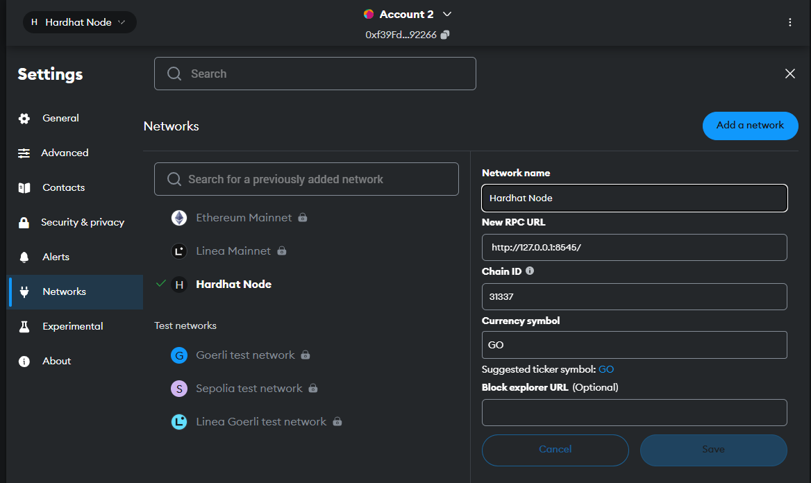
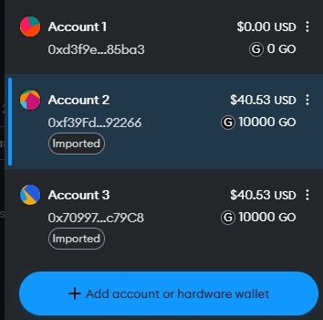
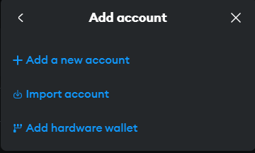
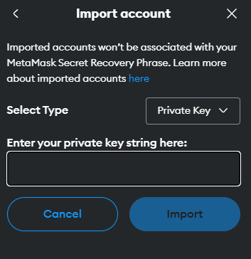

# NFT Marketplace

## Setting Up
### 1. Clone/Download the Repository

### 2. Install Dependencies:
```
$ cd nft_marketplace
$ npm install
```
### 3. Boot up local development blockchain
```
$ cd nft_marketplace
$ npx hardhat node
```

### 4. Connect development blockchain accounts to Metamask
- Connect your metamask to hardhat blockchain, network 127.0.0.1:8545.


- If you have not added hardhat to the list of networks on your metamask, open up a browser, click the fox icon. For the "Network Name" field enter "Hardhat". For the "New RPC URL" field enter "http://127.0.0.1:8545". For the chain ID enter "31337". Then click save.  



- Copy private key of the addresses and import to Metamask





### 5. Migrate Smart Contracts
`npx hardhat run src/backend/scripts/deploy.js --network localhost`

### 6. Run Tests
`$ npx hardhat test`

### 7. Launch Frontend
`$ npm run start`

License
----
ADP
